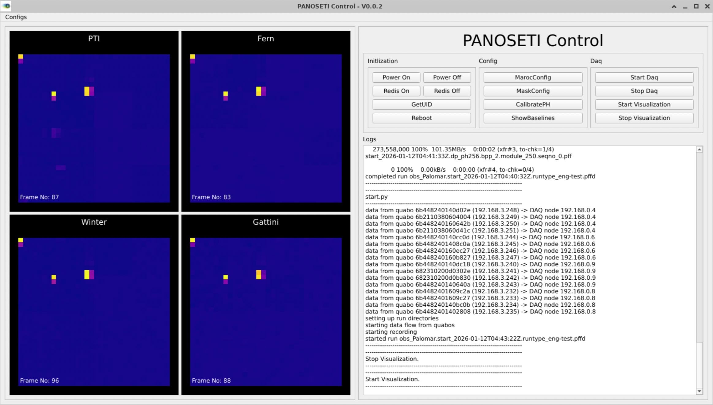

# PANOSETI CONTROL GUI
This GUI is based on [panoseti software](https://github.com/panoseti/panoseti) and [panoseti grpc](https://github.com/panoseti/panoseti_grpc.git).  


# Get Started
1. Install [Miniconda](https://docs.conda.io/en/latest/miniconda.html)(optional)  
Miniconda is recommended to create a vritual python environment, so that it won't mess up the python environment on your system.  
If miniconda is installed, please create and activate the python environment.
    ```
    conda create -n ps_gui python=3.9
    conda activate ps_gui
    ``` 
2. clone the repository
    ```
    git clone https://github.com/liuweiseu/panoseti_control_gui.git
    ```
3. update submodule
    ```
    cd panoseti_control_gui
    git submodule update
    git submodule init
    ```
4. install necessary packages for pyqt
    ```
    pip install pyqt6
    # or
    conda install -c conda-forge pyqt=6

    pip install pyqtgraph
    # or 
    conda  install -c conda-forge pyqtgraph
    ```
    **Note:** If you use `pip install pyqt6`, you may have to install necessary libraries
    ```
    sudo apt update
    sudo apt install libxcb-cursor0
    ```
5. install necessary packages for grpc
    ```
    pip install -r panoseti_grpc/requirements.txt
    ```
6. set the config file  
    You need to set the `configs/panoseti_config.json`:  
    ```
    {
        "panoseti_sw": {
            "sw_path": "/home/test/panoseti",
            "python_path": "/home/test/miniconda3/envs/py39/bin/python"
        },
        "pyqt": {
            "python_path": "/home/test/miniconda3/envs/grpc/bin/python"
        }
    }   
    ```
# Start GUI
There are two ways to start the GUI:
1. activate the conda env, and start `main.py`
    ```
    conda activate ps_gui
    python main.py
    ```
2. set the config file, and start the GUI through the shell script
    ```
    ./panoseti_control.sh
    ```

