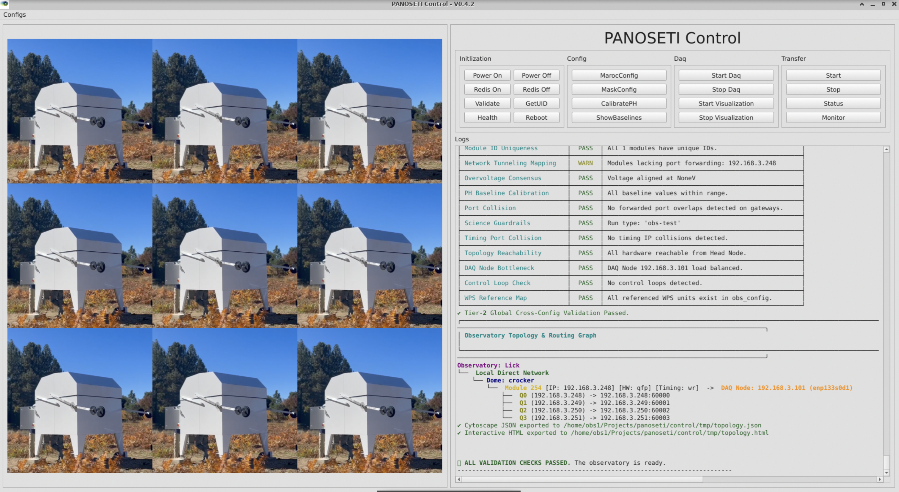
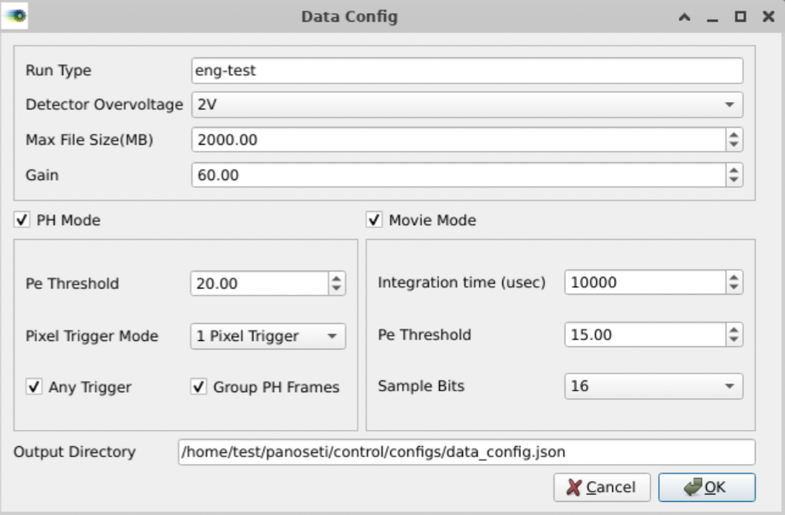

# PANOSETI CONTROL GUI
This GUI is based on [panoseti software](https://github.com/panoseti/panoseti) and the [panoseti-grpc](https://pypi.org/project/panoseti-grpc/) package.  
  



# Get Started
1. Install [uv](https://docs.astral.sh/uv/getting-started/installation/)
2. clone the repository
    ```
    git clone https://github.com/liuweiseu/panoseti_control_gui.git
    cd panoseti_control_gui
    ```
3. install dependencies
    ```
    uv sync
    ```
    **Note:** On Linux, PyQt6 may need an extra system library
    ```
    sudo apt update
    sudo apt install libxcb-cursor0
    ```
4. install the `pseti` CLI (from the [panoseti](https://github.com/panoseti/panoseti) repo's `control/` package) as a
   standalone tool, so it's on your `PATH` — the power/DAQ/config buttons in the GUI shell out to it by name:
    ```
    uv tool install --editable /path/to/panoseti/control
    ```
    Use `--editable` so the installed `pseti` keeps resolving its config/state directories from your actual
    `panoseti` checkout (see [CLAUDE.md](CLAUDE.md) for why).
5. set the config file  
    `configs/grpc_config.json` points the image-streaming backend at your `daq_config.json`/
    `network_config.json`/`hp_io_config*.json` — edit the paths in that file for your deployment.
# Start GUI
There are two ways to start the GUI:
1. run it inside the repo with uv
    ```
    uv run pseti-gui
    ```
2. install it as a standalone command, then run it from anywhere
    ```
    uv tool install .
    pseti-gui
    ```
Once the image-streaming backend (Start gRPC button) is running, its stdout/stderr are printed directly to
the terminal `pseti-gui` was launched from.

